# FMC — Focal Mechanism Classification

**A program to manage, classify, cluster and plot earthquake focal mechanism data**

[](LICENSE)
[](https://www.python.org/)
[](https://doi.org/10.1016/j.softx.2019.03.008)

FMC version 1.10 · Manual revision: September 2026
José A. Álvarez-Gómez · Faculty of Geology, Universidad Complutense de Madrid

A printable version of this manual is available at [`docs/FMC_manual.pdf`](docs/FMC_manual.pdf).

## Contents

- [Part I — The manual](#part-i--the-manual)
  - [1. Introduction](#1-introduction)
  - [2. Versions](#2-versions)
  - [3. Installation](#3-installation)
  - [4. Usage](#4-usage)
  - [5. License](#5-license)
- [Part II — The background](#part-ii--the-background)
  - [6. Introduction](#6-introduction)
  - [7. The focal mechanism](#7-the-focal-mechanism)
  - [8. Parameters computed by FMC](#8-parameters-computed-by-fmc)
  - [9. Diagram](#9-diagram)
  - [10. Focal Mechanism Classification](#10-focal-mechanism-classification)
  - [11. The source-type diagram](#11-the-source-type-diagram)
- [Acknowledgments](#acknowledgments)
- [References](#references)

## Part I — The manual

### 1. Introduction

This is the user manual for the program `FMC` (from Focal Mechanisms Classification). This program was originally developed on Python 2.7.3 and adapts some of the Gasperini and Vannucci (2003) FORTRAN routines to obtain the different parameters of the earthquake focal mechanisms depending on the input format. Since version 1.3 it is compatible with Python 3. Several output formats are eligible, clustering analysis of the data can be performed and a classification diagram for the focal mechanisms is produced; a source-type diagram of the moment tensors can also be plotted. The default input and output formats are the same used by the GMT program `psmeca` in order to make the program integration easiest and facilitate the mapping of the data.

The program basically takes the focal mechanisms data, computes the different parameters that can be obtained, classifies each focal mechanism in one of seven possible types, perform a clustering analysis of the data if it is required by the user and optionally outputs the parameters in different formats and generates a classification diagram from the input data.

### 2. Versions

**1.10**

New features:

- New parameter `Gamma`: CLVD index of Kagan and Knopoff (1985), computed from the deviatoric eigenvalues. It is included in the `ALL` output after `fclvd`, so the following columns move one position.

- The left label of the source-type diagram is now “CLVD (+)”, and the symbol of maximum magnitude of its legend keeps its position.

Changes:

- The CLVD ratio `fclvd` is computed from the deviatoric eigenvalues and follows the definition of Frohlich and Davis (1999): it is positive for tension-dominated CLVD, as in the source-type diagram and in Vavryčuk (2015). Its sign is opposite to that of versions 1.8.1 to 1.9.1 (section [8](#8-parameters-computed-by-fmc)).

**1.9.1**

Bug fixes:

- Labels (`-pa`) with NumPy 2.x; source-type diagram (`-pd`) with a single event, equal magnitudes or `PT` input; no `NaN` for mechanisms at the centre of the classification diagram.

- `-pg` without a value uses its default (10); `-pc` with a non-numeric parameter (such as an alphanumeric `ID`) gives a warning and white symbols; the default plot title is the file name without path or extension.

- Clear error message when the clustering methods `centroid`, `median` or `ward` are used with a non-Euclidean metric.

- Magnitude legend formatted as 8.0 (previously 8.); the text label of the source-type diagram is no longer clipped; the version number shown by `-h` is correct.

**1.9**

New features:

- The symbol sizes of the diagrams are scaled to the magnitude range of the input data; the legend shows the minimum and maximum Mw.

**1.8.1**

Changes:

- The CLVD ratio `fclvd` follows the definition of Giardini (1984): it is now a signed value between $`-0.5`$ and $`+0.5`$ (previously its absolute value, as in (Frohlich and Apperson, 1992)). The sign convention was reversed in version 1.10.

**1.8**

New features:

- New output parameter `fiso`: ratio between the isotropic component and the scalar seismic moment.

**1.7**

New features:

- New input format `PT`: orientation of the P and T axes, for instance strain axes obtained from fault-slip analysis.

- New parameter `data1`: a free numeric value carried with the `PT` input, usable to colour or label the symbols.

**1.6**

New features:

- Source-type diagram of Hudson et al. (1989) (flag `-pd`) and new parameters `u_Hudson` and `v_Hudson`.

**1.5.1**

Bug fixes:

- Correction in the data reading routine (`genfromtxt`).

Changes:

- Adjustment of the T and B axes labels in the diagram.

**1.5**

Bug fixes:

- Several corrections.

New features:

- Warning when a non-numeric parameter is used to fill the symbols.

**1.4**

New features:

- Custom plot title (flag `-pt`).

Bug fixes:

- Several corrections.

**1.3**

New features:

- Added support for Python 3.

- Added new base diagram labels and tick marks.

- Added symbol labeling.

- Added gridlines plotting.

- Added isotropic component output.

**1.2**

New features:

- Added slip sense and plunge parameters for each focal mechanism nodal plane.

**1.1**

New features:

- New custom output parsing. The user can choose between the standard predefined output or any parameters in any order.

- Added a header with the parameter name in the output.

- Added symbol coloring.

- Added hierarchical clustering with several methods and options.

**1.01**

New features:

- Column number is now included in the header of the output file with all the parameters.

Bug fixes:

- Error in the nd2ar function to obtain the tensor components from the nodal planes.

**1.0**

Initial release of `FMC` with basic plotting function and focal mechanisms management.

### 3. Installation

`FMC` has been programmed in Python 3 and uses several common python libraries: `sys`, `argparse`, `os`, `NumPy`, `SciPy` and `matplotlib`. Depending on your operative system and Python installation you could need to install some of the libraries manually.

For **Windows** and **Mac** users a good starting point is the installation of predefined packages. From [www.SciPy.org](http://www.SciPy.org) you can download program packages that includes` Python`, `NumPy`, `SciPy` and `matplotlib`, as well as other modules and IDEs. With one of these packages installed `FMC` should work properly.

For **Linux** users all the required software can be easily installed through your favorite distribution repository (the python modules` sys`, `argparse` and `os` are usually installed with the default python installation).

The libraries can also be installed with `pip`: `pip install numpy scipy matplotlib`.

`FMC` is formed by three files that must be kept in the same directory: `FMC.py` (main program), `functionsFMC.py` (computational functions) and `plotFMC.py` (plotting functions). The repository includes a small test file, `jap_select.dat`, with 16 large earthquakes from Japan in Global CMT format. The command `FMC.py jap_select.dat` should print the 16 events with a new column with their rupture type.

### 4. Usage

The user interface is as simple as a “command line”, or a “terminal”. I decided to keep the program interface as simple as possible so it can be integrated into scripts with other programs such as [GMT](http://www.soest.hawaii.edu/gmt5/), `AWK (or `[`gawk`](http://www.gnu.org/software/gawk/)`)` or any other tool running from a shell or script (in \*nix) or a command window or batch file (in Windows/DOS). In the following the commands are written assuming that your python installation recognizes automatically the python format. In some systems, depending on your personal configuration, you will need to call first Python (like “`python FMC.py...`” or ”`python3 FMC.py...`”) or in a \*nix system with the “./” needed to execute a script (like `./FMC.py ...`).

In \*nix you will need to give execution permission to the program:

``` bash
chmod +x FMC.py
```

To run `FMC` on a file simply type in the terminal:

``` bash
FMC.py input-file.dat
```

By default `FMC` will read the input file as a `psmeca` Centroid Moment Tensor (CMT) format (in Harvard convention). This kind of file can be downloaded directly from [Global CMT](http://www.globalcmt.org/). The output will be shown on the screen in` psmeca` CMT format so it can be directly pipe into `psmeca:`

``` bash
FMC.py input-file.dat | psmeca -R {...etc}
```

Or stored as an ASCII file:

``` bash
FMC.py input-file.dat > output-file.dat
```

In this case `FMC` will add a new column at the end of each register with the focal mechanism type.

Alternatively the input file can be a single plane in Aki and Richards (1980) convention (Right Hand Rule for the plane orientation, and rakes from 0 to 180 in reverse faults and 0 to -180 in normal faults, 0 for left-lateral and $`\pm`$180 for right-lateral). This format is also compatible with `psmeca`.

#### 4.1 Input

`FMC` input can be given as an ASCII file or as standard input, from a pipe (“\|”) or a redirection (“\<”). The following codes are then equivalent:

``` bash
FMC.py input-file.dat

cat input-file.dat | FMC.py

FMC.py < input-file.dat
```

If no input is given, then `FMC` will show the on-screen help.

The input format is specified with the optional flag “`-i`”, and the possible values are:

- **CMT**: Harvard Centroid Moment Tensor (by default):  
  `[longitude, latitude, depth, mrr, mtt, mff, mrt, mrf, mtf, Exponent (dyn-cm), X plot, Y plot (for GMT), ID]`
- **AR**: Aki and Richards one plane convention:  
  `[longitude, latitude, depth, strike, dip, rake, magnitude (Mw), X plot, Y plot (for GMT), ID]`
- **P**: Both nodal planes and scalar seismic moment:  
  `[longitude, latitude, depth, strike A, dip A, rake A, strike B, dip B, rake B, Scalar seismic moment mantissa, Exponent (dyn-cm), X plot, Y plot (for GMT), ID]`
- **PT**: Orientation of the P and T axes:  
  `[longitude, latitude, trend P, plunge P, trend T, plunge T, data1, X plot, Y plot (for GMT), ID]`

The data are whitespace-separated columns, one event per line. Lines starting with `#` are ignored, so the header written by `FMC` does not disturb a later reading. Every line must have the exact number of columns of the chosen format, and the `ID` must not contain spaces. With the `P` format the axes and the moment tensor are computed from plane A.

The `PT` format is intended for tensors that are not earthquake focal mechanisms, such as the shortening (P) and extension (T) axes obtained from fault-slip inversion; the P and T axes must be orthogonal. `data1` is any numeric value (a site number, the number of faults, a misfit...) that can be used to colour (`-pc data1`) or label (`-pa data1`) the symbols or to perform the clustering (`-ci data1`). As there is no depth or magnitude information `FMC` assigns depth 0, $`M_0=10^{20}`$ dyn$`\cdot`$cm and Mw 8.0.

#### 4.2 Output

`FMC` output format can be selected among the following options with the flag “`-o`”:

- **CMT**: Harvard Centroid Moment Tensor (`psmeca` compatible):  
  `[longitude, latitude, depth, mrr, mtt, mff, mrt, mrf, mtf, Exponent (dyn·cm), X plot, Y plot (for GMT), ID, TYPE]`
- **P**: Focal mechanism both nodal planes (`psmeca` compatible):  
  `[longitude, latitude, depth, strike A, dip A, rake A, strike B, dip B, rake B, Scalar seismic moment mantissa, Exponent (dyn·cm), X plot, Y plot (for GMT), ID, TYPE]`
- **AR**: Focal mechanism one plane (`psmeca` compatible):  
  `[longitude, latitude, depth, strike, dip, rake, magnitude (Mw), X plot, Y plot (for GMT), ID, TYPE]`
- **K**: Kaverina diagram position for plotting outside FMC:  
  `[X Kaverina diagram, Y Kaverina diagram, Mw, Depth, ID, TYPE]`
- **ALL**: All the parameters obtained:  
  `[longitude, latitude, depth, mrr, mtt, mff, mrt, mrf, mtf, Exponent (dyn·cm), Scalar seismic moment (dyn·cm), Mw, strike A, dip A, rake A, strike B, dip B, rake B, Slip trend A, Slip plunge A, Slip trend B, Slip plunge B, P trend, P plunge, B trend, B plunge, T trend, T plunge, fclvd, Gamma, Isotropic component, Isotropic ratio, u Hudson, v Hudson, X Kaverina diagram, Y Kaverina diagram, ID, TYPE]`
- **CUSTOM**: In case you need any focal mechanism parameters in any order you can use the CUSTOM option and give the requested parameters in any order using the flag “`-of`”. The output parameters need to be listed separated by commas. The accepted parameters names are listed below, and can be seen on the terminal using `FMC.py -helpFields`
  - **lon**: longitude
  - **lat**: latitude
  - **dep**: depth
  - **mrr**: mrr centroid moment tensor component
  - **mtt**: mtt centroid moment tensor component
  - **mff**: mff centroid moment tensor component
  - **mrt**: mrt centroid moment tensor component
  - **mrf**: mrf centroid moment tensor component
  - **mtf**: mtf centroid moment tensor component
  - **mant**: mantissa of the seismic moment tensor
  - **expo**: exponent of the seismic moment tensor
  - **Mo**: Scalar seismic moment
  - **Mw**: Moment (or Kanamori) magnitude
  - **strA**: Strike of nodal plane A
  - **dipA**: Dip of nodal plane A
  - **rakeA**: Rake of nodal plane A
  - **strB**: Strike of nodal plane B
  - **dipB**: Dip of nodal plane B
  - **rakeB**: Rake of nodal plane B
  - **slipA**: Trend of the slip vector of plane A
  - **plungA**: Plunge of slip vector of plane A
  - **slipB**: Trend of the slip vector of plane B
  - **plungB**: Plunge of slip vector of plane B
  - **trendp**: Trend of P axis
  - **plungp**: Plunge of P axis
  - **trendb**: Trend of B axis
  - **plungb**: Plunge of B axis
  - **trendt**: Trend of T axis
  - **plungt**: Plunge of T axis
  - **fclvd**: Compensated linear vector dipole ratio (positive for tension; section [8](#8-parameters-computed-by-fmc))
  - **Gamma**: CLVD index of Kagan and Knopoff (1985)
  - **iso**: Isotropic component of the Moment Tensor
  - **fiso**: Ratio between the isotropic component and the scalar seismic moment
  - **u_Hudson**: u position on the source-type diagram
  - **v_Hudson**: v position on the source-type diagram
  - **x_kav**: x position on the Kaverina diagram
  - **y_kav**: y position on the Kaverina diagram
  - **ID**: ID of the event
  - **clas**: Focal mechanism rupture type
  - **posX**: X plotting position for GMT psmeca
  - **posY**: Y plotting position for GMT psmeca
  - **clustID**: Cluster number (0 if no clustering analysis is done)
  - **data1**: Free numeric value of the `PT` input (0 otherwise)

All the output formats start with a header line, beginning with `#`, with the name of each column. Except `CUSTOM`, all of them add the rupture type (`TYPE`) as last column, and the cluster number (`Cluster_ID`) when a clustering analysis is done. In the `CMT` output the tensor components are rescaled to the exponent of the computed scalar moment, so the output exponent may differ from the input one.

Columns of the `ALL` output (useful to select fields with `awk`):

| \#  | Header             | \#  | Header        | \#  | Header                     |
|:----|:-------------------|:----|:--------------|:----|:---------------------------|
| 1   | Longitude          | 14  | Dip_A         | 27  | Trend_T                    |
| 2   | Latitude           | 15  | Rake_A        | 28  | Plunge_T                   |
| 3   | Depth\_(km)        | 16  | Strike_B      | 29  | fclvd                      |
| 4   | mrr                | 17  | Dip_B         | 30  | Gamma                      |
| 5   | mtt                | 18  | Rake_B        | 31  | Isotropic                  |
| 6   | mff                | 19  | Slip_trend_A  | 32  | Iso_ratio                  |
| 7   | mrt                | 20  | Slip_plunge_A | 33  | u_Hudson                   |
| 8   | mrf                | 21  | Slip_trend_B  | 34  | v_Hudson                   |
| 9   | mtf                | 22  | Slip_plunge_B | 35  | X_Kaverina                 |
| 10  | Exponent\_(dyn-cm) | 23  | Trend_P       | 36  | Y_Kaverina                 |
| 11  | Seismic_moment_Mo  | 24  | Plunge_P      | 37  | ID                         |
| 12  | Magnitude_Mw       | 25  | Trend_B       | 38  | rupture_type               |
| 13  | Strike_A           | 26  | Plunge_B      | 39  | Cluster_ID (if clustering) |

##### Examples of use

**Obtaining nodal planes from moment tensor**

Command:

``` bash
echo -2.54 37.09 12 -3.4669 -2.0652 5.5321 6.2368 -1.8004 -5.1775 22 X Y ID | FMC.py -o P
```

Result:

``` text
#Longitude Latitude Depth_(km) Strike_A Dip_A Rake_A Strike_B Dip_B Rake_B Seismic_moment_mantissa Exponent_(dyn-cm) X_position(GMT) Y_position(GMT) ID rupture_type
-2.54 37.09 12.0 190.925 42.4899 -20.9735 296.709 76.0089 -130.541 9.611967 22.0 X Y ID N-SS
```

**Obtaining moment tensor from one nodal plane**

Command:

``` bash
echo -2.54 37.09 12 190.925 42.4899 -20.9735 4.6 X Y ID | FMC.py -i AR -o CMT
```

Result:

``` text
#Longitude Latitude Depth_(km) mrr mtt mff mrt mrf mtf Exponent_(dyn-cm) X_position(GMT) Y_position(GMT) ID rupture_type
-2.54 37.09 12.0 -3.56563 -2.21928 5.78491 6.70126 -1.61249 -5.19047 22.0 X Y ID N-SS
```

**Obtaining all the parameters from the moment tensor**

Command:

``` bash
echo -2.54 37.09 12 -3.4669 -2.0652 5.5321 6.2368 -1.8004 -5.1775 22 X Y ID | FMC.py -o ALL
```

Result:

``` text
#Longitude Latitude Depth_(km) mrr mtt mff mrt mrf mtf Exponent_(dyn-cm) Seismic_moment_Mo Magnitude_Mw Strike_A Dip_A Rake_A Strike_B Dip_B Rake_B Slip_trend_A Slip_plunge_A Slip_trend_B Slip_plunge_B Trend_P Plunge_P Trend_B Plunge_B Trend_T Plunge_T fclvd Gamma Isotropic Iso_ratio u_Hudson v_Hudson X_Kaverina Y_Kaverina ID rupture_type
-2.54 37.09 12.0 -3.4669 -2.0652 5.5321 6.2368 -1.8004 -5.1775 22.0 9.61197e+22 4.6 190.925 42.4899 -20.9735 296.709 76.0089 -130.541 206.709 -13.9911 100.925 -47.5101 167.141 43.8185 308.393 39.1024 56.0979 20.5155 0.0445259 0.117979 -1398100.0 -1.45454e-17 -0.0890517 0.0 -0.243839 0.0899979 ID N-SS
```

**Obtaining all the parameters from CMT input file and storing to an ASCII file**

Command:

``` bash
FMC.py -o ALL jap_select.dat > Japan_parameters.dat
```

**Using CUSTOM output to obtain event location and slip vector of both nodal planes**

Command:

``` bash
echo -2.54 37.09 12 -3.4669 -2.0652 5.5321 6.2368 -1.8004 -5.1775 22 X Y ID | FMC.py -o CUSTOM -of lon,lat,slipA,plungA,slipB,plungB
```

Result:

``` text
#Longitude Latitude Slip_trend_A Slip_plunge_A Slip_trend_B Slip_plunge_B
-2.54 37.09 206.709 -13.9911 100.925 -47.5101
```

**Obtaining the CLVD parameters of a catalogue**

Command:

``` bash
FMC.py -o CUSTOM -of ID,Mw,fclvd,Gamma,clas jap_select.dat
```

Result (first events):

``` text
#ID Magnitude_Mw fclvd Gamma rupture_type
032378C 7.6 0.00882022 0.0230146 R
052683A 7.7 0.122769 0.33196 R
110189E 7.4 0.050104 0.133035 R
071293B 7.7 0.0604748 0.161154 R
```

**Obtaining nodal planes and B axis from P and T axes (PT input)**

Command:

``` bash
FMC.py -i PT -o CUSTOM -of ID,trendb,plungb,strA,dipA,rakeA,strB,dipB,rakeB,clas,data1 pt_example.dat
```

Result:

``` text
#ID Trend_B Plunge_B Strike_A Dip_A Rake_A Strike_B Dip_B Rake_B rupture_type data1
S1 350.0 80.0 214.561 82.947 -7.10708 305.439 82.947 -172.893 SS 12.0
S2 200.0 85.0 155.109 86.4667 -176.46 64.8908 86.4667 -3.54002 SS 25.0
S3 315.0 1.59028e-15 315.0 25.0 -90.0 135.0 65.0 -90.0 N 8.0
S4 210.0 7.95139e-15 210.0 15.0 90.0 30.0 75.0 90.0 R 40.0
S5 120.0 50.0 337.454 62.966 -30.6821 82.5463 62.966 -149.318 SS-N 30.0
```

**Using an FMC output as input**

The extra column with the rupture type must be removed first, for instance with `awk`:

``` bash
FMC.py -o AR jap_select.dat | awk '{$NF=""; print}' | FMC.py -i AR -o CMT
```

#### 4.3 Plot

Optionally `FMC` will produce a classification diagram. `FMC` uses `matplotlib` libraries and can generate figures in different formats (emf, eps, jpeg, jpg, pdf, png, ps, raw, rgba, svg, svgz, tif, tiff). The format is determined automatically from the plot file name extension.

The diagram uses the Kaverina et al. (1996) projection technique, used also by Kagan (2005); but incorporating a classification similar to the geological conceptual classification of faults. The earthquakes are classified into seven types according to the values of the P, T and B Centroid Moment Tensor axes following a simple algorithm (Figure 1), and are represented conveniently on the Kaverina diagram (Figure 2). This classification is very similar to the used by Johnston et al. (1994).

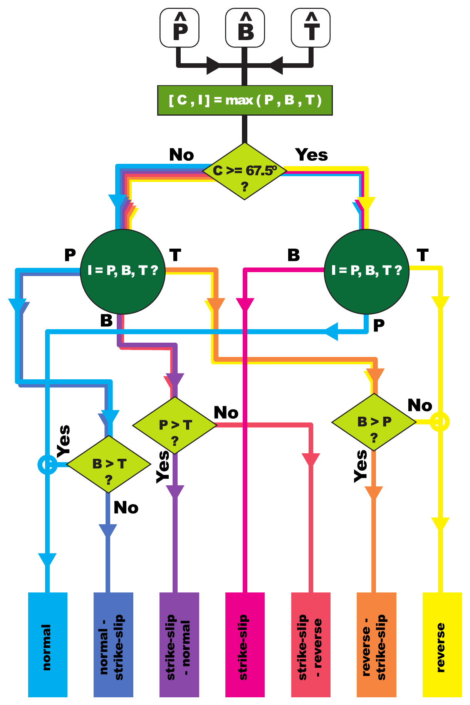

*Figure 1. Focal mechanism classification algorithm flow chart.*

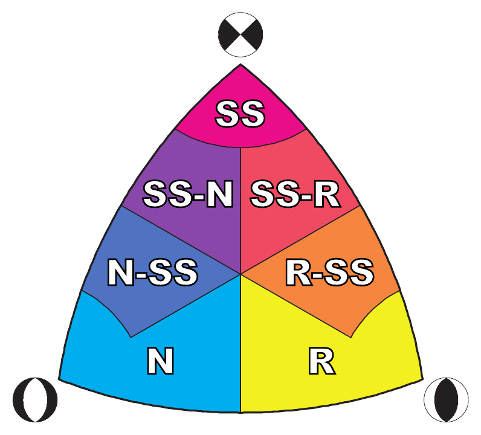

*Figure 2. Classification diagram. N: Normal; N-SS: Normal - Strike-slip; SS-N: Strike-slip - Normal; SS: Strike-slip; SS-R: Strike-slip - Reverse; R-SS: Reverse - Strike-slip; R: Reverse.*

The size of the symbols is proportional to the magnitude, scaled between the minimum and maximum Mw of the data, which are shown in the legend. `FMC` uses several flags in order to customize the plot.

- **`-p`**: This flag activates the plotting. It must be followed by the name of the figure file that will be produced. The name used for the file (without the extension) is used as title for the plot, unless a different one is given with `-pt`.
- **`-pd`**: This flag plots the source-type diagram of Hudson et al. (1989) (section [11](#11-the-source-type-diagram)) in the given file. The flags `-pc`, `-pa` and `-pt` also work with this diagram.
- **`-pc`**: With this flag the user specifies the parameter that is used to fill the symbols. A color palette is produced with the range of the selected parameter values. The parameter must be numeric; otherwise `FMC` gives a warning and draws white symbols.
- **`-pg`**: This flag is used to plot gridlines with the specified grid spacing (10 degrees if no value is given).
- **`-pa`**: This flag is used to annotate the symbols with a certain parameter.
- **`-pt`**: Plot title. `-pt " "` removes the title.

With `-pc` and `-pa` the parameters must be given with its corresponding internal name as listed in section 4.2.

##### Examples of use

**Plotting data from standard input**

Command:

``` bash
echo -2.54 37.09 12 -3.4669 -2.0652 5.5321 6.2368 -1.8004 -5.1775 22 X Y ID | FMC.py -p "My data.png"
```

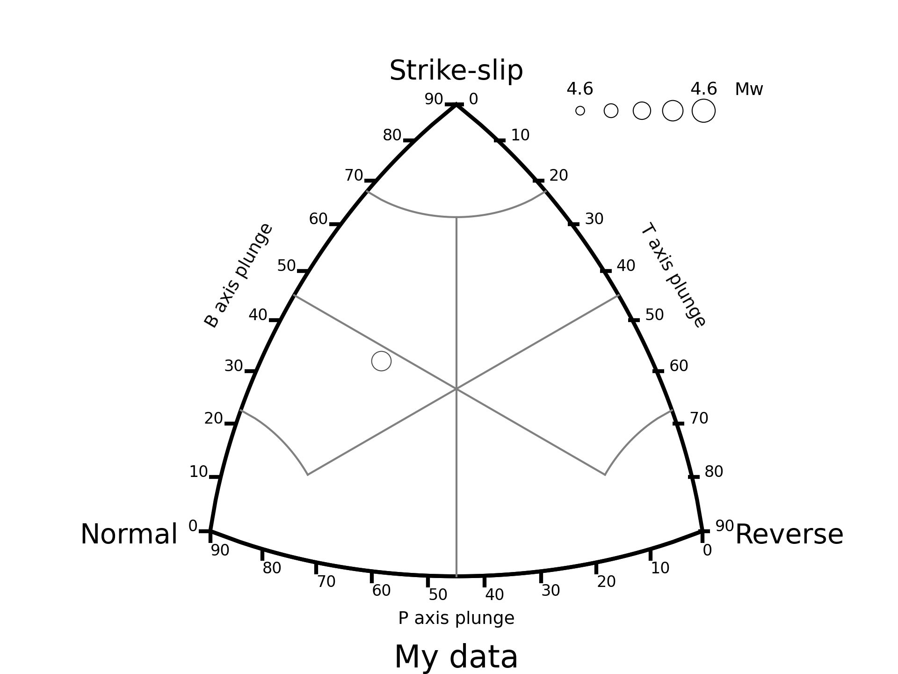

*Figure 3. Plot result from the command `echo -2.54 37.09 12 -3.4669 -2.0652 5.5321 6.2368 -1.8004 -5.1775 22 X Y ID | FMC.py -p “My data.png”`*

**Plotting data from input file, shading the symbols with a parameter and plotting gridlines**

Command:

``` bash
FMC.py -p 'Japan data.png' jap_select.dat -pc dep -pg 10 -pt "Japan, Mw >= 7.2"
```

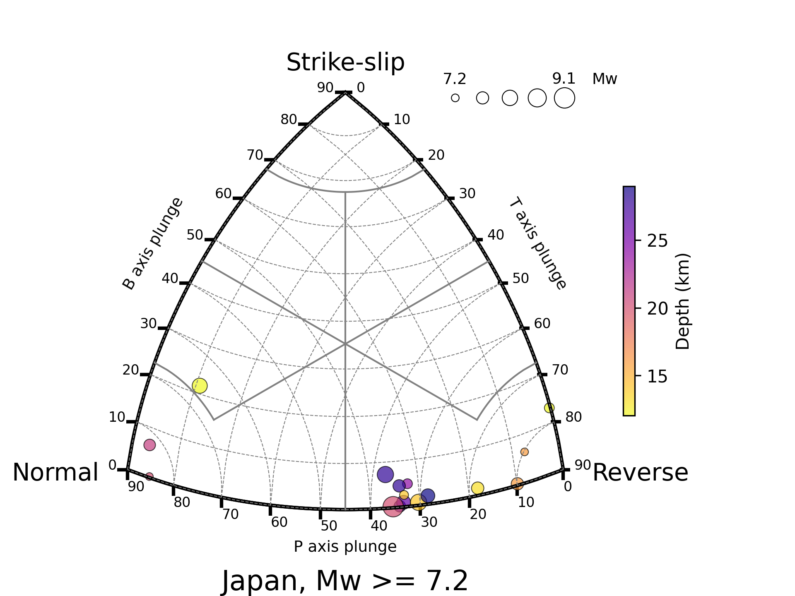

*Figure 4. Plot result from the command `FMC.py -p ’Japan data.png’ jap_select.dat -pc dep -pg 10 -pt “Japan, Mw >= 7.2”`*

**Plotting data from input file shading and annotating the symbols**

Command:

``` bash
FMC.py jap_select.dat -p 'Japan labels.png' -pc dep -pa Mw -pt "Japan, Mw >= 7.2"
```

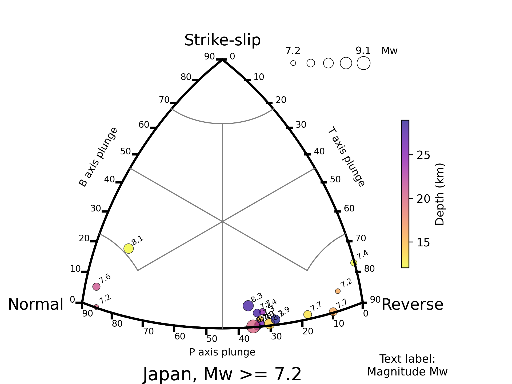

*Figure 5. Plot result from the command `FMC.py jap_select.dat -p ’Japan labels.png’ -pc dep -pa Mw -pt “Japan, Mw >= 7.2”`*

**Plotting the source-type diagram**

Command:

``` bash
FMC.py jap_select.dat -pd 'Japan source type.png' -pc fclvd -pt "Japan, source type"
```

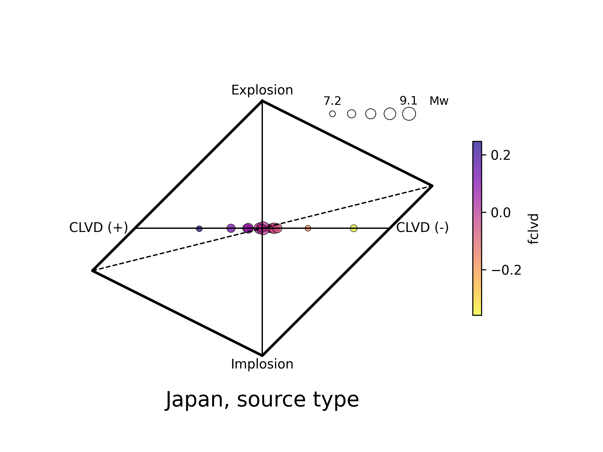

*Figure 6. Plot result from the command `FMC.py jap_select.dat -pd ’Japan source type.png’ -pc fclvd -pt “Japan, source type”`. The Global CMT solutions are deviatoric, so all the events lie on the horizontal axis. Symbols are coloured by `fclvd`: positive values (purple, tension-dominated CLVD) plot on the left and negative values (yellow) on the right (section [8](#8-parameters-computed-by-fmc)).*

**Plotting P and T axes from fault-slip analysis**

Command:

``` bash
FMC.py -i PT pt_example.dat -p pt_axes.png -pc data1 -pt "Strain axes from fault-slip data"
```

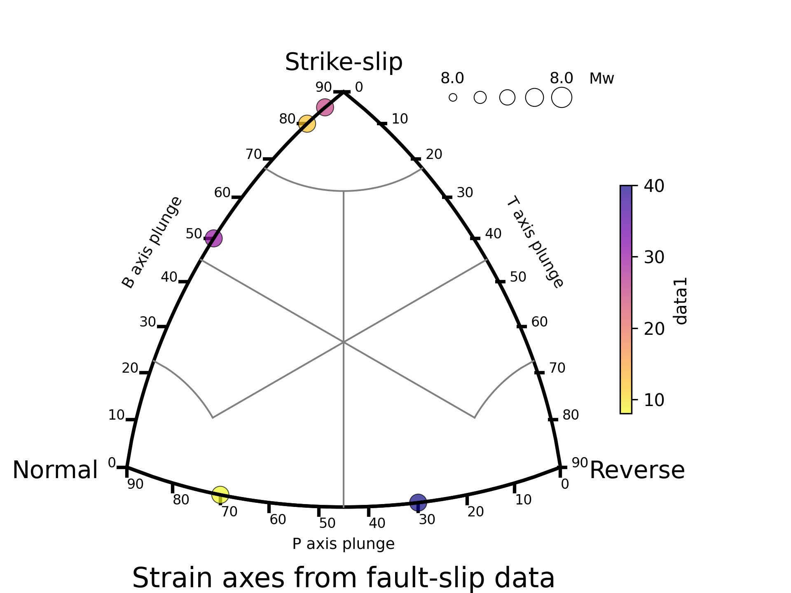

*Figure 7. Plot result from the command `FMC.py -i PT pt_example.dat -p pt_axes.png -pc data1 -pt “Strain axes from fault-slip data”`. All symbols have the same size because this format has no magnitude information.*

**Plotting data from input file and piping to psmeca**

Command:

``` bash
FMC.py jap_select.dat | gmt psmeca -R125/170/30/60 -JM8c -Ba10f2WESN -Sm0.4c+f0 -Gred > CMT_map.ps
```

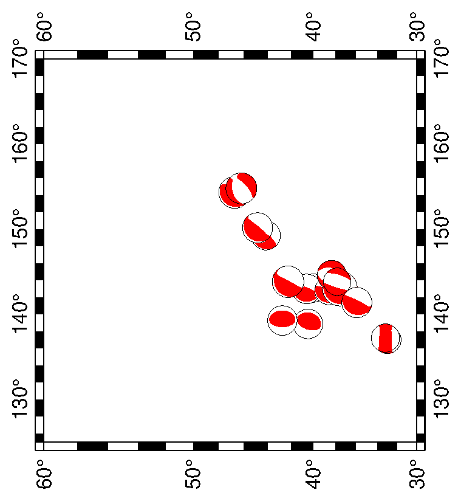

*Figure 8. Map generated with `psmeca` (`GMT`) from the `FMC` output.*

#### 4.4 Clustering

`FMC` implements the hierarchical agglomerative clustering algorithms from SciPy (scipy.cluster.hierarchy) in order to group the data[^1]. The advantages of this algorithms are its versatility, as the user can choose between a number of metrics and grouping methods, its capacity to automatically select a minimum number of clusters without an a priori estimation, and its potential to work with different parameters with different scales and with strong different populations in clusters.

The parameters for the clustering are passed by several optional flags. If any of the following flags is given in the command line `FMC` will perform the clustering analysis using some default options if needed. When a clustering analysis is done, by default `FMC` will shade the symbols in the diagram using the cluster number, unless a different parameter is stated with `-pc` flag. The cluster number of each event is added as a last column (`Cluster_ID`) to the output.

- **`-cm`**: Method to be used in the clustering analysis. The options are:
  - **single**: single/min/nearest $`d(u,v)=\min(dist(u\left[i\right],v\left[j\right]))`$
  - **complete**: complete/max/farthest point $`d(u,v)=\max(dist(u\left[i\right],v\left[j\right]))`$
  - **average**: average/UPGMA $`d(u,v)=\sum_{ij}\frac{d(u\left[i\right],v\left[j\right])}{(\left|u\right|*\left|v\right|)}`$
  - **weighted**: weighted/WPGMA $`d(u,v)=(dist(s,v)+dist(t,v))/2`$
  - **centroid**: centroid/UPGMC \[default\] $`dist(s,t)=\left\Vert c_{s}-c_{t}\right\Vert _{2}`$ where $`c_{s}`$ and $`c_{t}`$ are the centroids of clusters $`s`$ and $`t`$, respectively. When two clusters $`s`$ and $`t`$ are combined into a new cluster $`u`$, the new centroid is computed over all the original objects in clusters $`s`$ and $`t`$. The distance then becomes the Euclidean distance between the centroid of $`u`$ and the centroid of a remaining cluster $`v`$ in the forest.
  - **median**: median/WPGMC, assigns $`d(s,t)`$ like the centroid method. When two clusters $`s`$ and $`t`$ are combined into a new cluster $`u`$, the average of centroids $`s`$ and $`t`$ give the new centroid.
  - **ward**: Ward variance minimization algorithm. $`d(u,v)=\sqrt{\frac{\left|v\right|+\left|s\right|}{T}d(v,s)^{2}+\frac{\left|v\right|+\left|t\right|}{T}d(v,t)^{2}-\frac{\left|v\right|}{T}d(s,t)^{2}}`$ where $`u`$ is the newly joined cluster consisting of clusters $`s`$ and $`t`$, $`v`$ is an unused cluster in the forest,$`T=\left|v\right|+\left|s\right|+\left|t\right|`$, and $`\left|*\right|`$ is the cardinality of its argument.

  Methods “centroid”, “median” and “ward” are correctly defined only if Euclidean pairwise metric is used. Since `centroid` is the default method, any other metric given with `-ce` must be combined with `-cm single`, `complete`, `average` or `weighted`; otherwise `FMC` stops with an error message.
- **`-ce`**: Metric used to measure distances between events parameters. These metrics work with non-Boolean vectors. By default `FMC` uses euclidean distance.
  - **braycurtis**: The Bray-Curtis distance between two points $`u`$ and $`v`$ is $`d(u,v)=\frac{\sum_{i}\left|u_{i}-v_{i}\right|}{\sum_{i}\left|u_{i}+v_{i}\right|}`$
  - **canberra**: The Canberra distance between two points $`u`$ and $`v`$ is $`d(u,v)=\underset{i}{\sum}\frac{\left|u_{i}-v_{i}\right|}{\left|u_{i}\right|+\left|v_{i}\right|}`$
  - **chebyshev**: The Chebyshev distance between two n-vectors $`u`$ and $`v`$ is the maximum norm-1 distance between their respective elements. More precisely, the distance is given by $`d(u,v)=\underset{i}{\max}\left|u_{i}-v_{i}\right|`$
  - **cityblock**: City block or Manhattan distance between the points.
  - **correlation**: Correlation distance between vectors $`u`$ and $`v`$. This is $`1-\frac{(u-\bar{u})\cdot (v-\bar{v})}{\left\Vert (u-\bar{u})\right\Vert _{2}\left\Vert (v-\bar{v})\right\Vert _{2}}`$
  - **cosine**: Cosine distance between vectors $`u`$ and $`v`$, $`1-\frac{u\cdot v}{\left\Vert u\right\Vert _{2}\left\Vert v\right\Vert _{2}}`$
  - **euclidean**: Distance between m points using Euclidean distance (2-norm). \[Default\]
  - **hamming**: Normalized Hamming distance, or the proportion of those vector elements between two n-vectors $`u`$ and $`v`$ which disagree.
  - **jaccard**: Jaccard distance between the points. Given two vectors, $`u`$ and $`v`$, the Jaccard distance is the proportion of those elements $`u[i]`$ and $`v[i]`$ that disagree.
  - **mahalanobis**: The Mahalanobis distance between two points $`u`$ and $`v`$ is $`\sqrt{(u-v)(1/V)(u-v)^{T}}`$ where $`1/V`$ is the inverse covariance matrix.
  - **minkowski**: Distances using the Minkowski distance $`\left\Vert u-v\right\Vert _{p}`$ (p-norm) where $`p\geq1`$.
  - **seuclidean**: Standardized Euclidean distance. The standardized Euclidean distance between two n-vectors $`u`$ and $`v`$ is $`\sqrt{\sum\left(u_{i}-v_{i}\right)^{2}\div V\left[x_{i}\right]}`$ $`V`$ is the variance vector; $`V[i]`$ is the variance computed over all the i’th components of the points. It is automatically computed.
  - **sqeuclidean**: Squared Euclidean distance $`\left\Vert u-v\right\Vert _{2}^{2}`$ between the vectors.
- **`-cn`**: A priori number of clusters to obtain. If zero or non-present the number of clusters is automatically computed with an elbow criterion on the dendrogram: the merging distances are taken from the last merge to the first and the number of clusters is set where their second difference is largest (the minimum is two clusters).
- **`-ci`**: Parameters used to perform the cluster analysis. By default `FMC` uses the position on the Kaverina diagram, which is a proxy for the principal moment tensor axes plunges. If the parameters given are not in the same physical magnitude and unit the euclidean distance is not appropriate and a different metric should be used. In these cases the Mahalanobis distance is a good choice, as is equivalent to the Euclidean distance in the transformed space, using the covariance matrix of each parameter. Angular parameters such as strikes and trends are circular (0° and 360° are the same direction), which is not taken into account by any of these metrics.
  The parameters must be given with its corresponding internal name as listed in section 4.2.

##### Examples of use

**Automatic clustering using the position in the Kaverina diagram (default)**

Command:

``` bash
FMC.py -p 'Japan clusters.png' jap_select.dat -cn 0 -pt "Japan, automatic clustering"
```

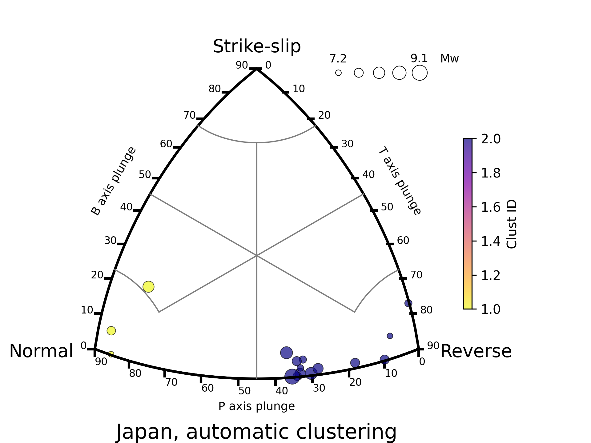

*Figure 9. Plot result from the command `FMC.py -p ’Japan clusters.png’ jap_select.dat -cn 0 -pt “Japan, automatic clustering”`*

The output contains the cluster of each event in the last column:

``` text
#ID Magnitude_Mw rupture_type Cluster_ID
032378C 7.6 R 2
052683A 7.7 R 2
110189E 7.4 R 2
071293B 7.7 R 2
```

**Clustering using the epicentral location**

Command:

``` bash
FMC.py jap_select.dat -cn 3 -ci lon,lat > clusters.dat
```

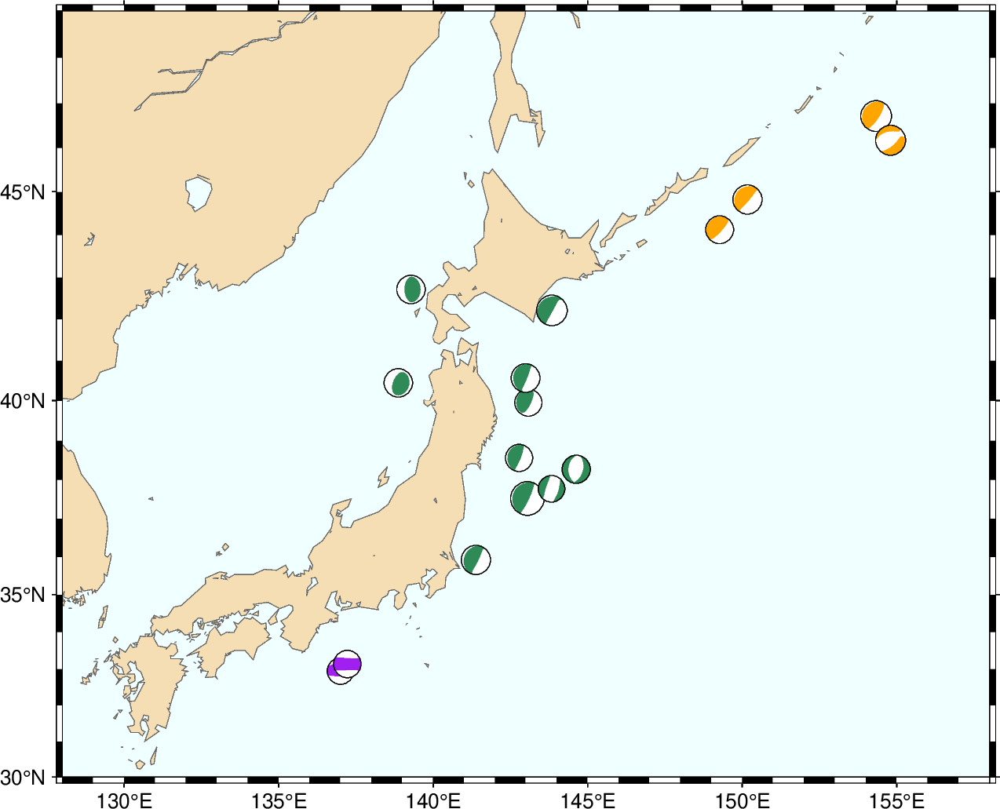

*Figure 10. Plotting with `GMT` of the clusters obtained with the command `FMC.py jap_select.dat -cn 3 -ci lon,lat` (see section 4.5).*

**Clustering using Mahalanobis metric and complete grouping with the slip and plunge of the slip vector of nodal plane A**

Command:

``` bash
FMC.py -p 'Japan clusters plane A.png' jap_select.dat -cn 3 -ci slipA,plungA -cm complete -ce mahalanobis
```

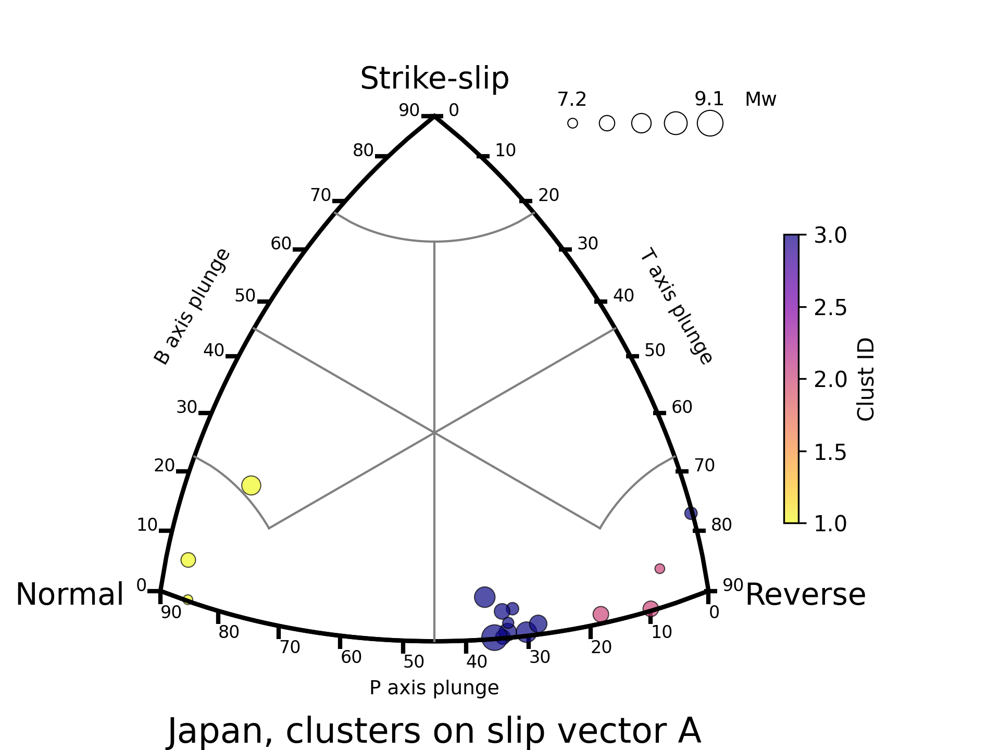

*Figure 11. Plot result from the command `FMC.py -p ’Japan clusters plane A.png’ jap_select.dat -cn 3 -ci slipA,plungA -cm complete -ce mahalanobis`*

#### 4.5 Working with GMT

The `CMT`, `P` and `AR` outputs can be read directly by the `GMT` module `meca` (`psmeca` in GMT 4 and 5), with the symbol options `-Sm`, `-Sc` and `-Sa` respectively. The header line starts with `#` and is skipped by `GMT`. The last columns (`ID`, `rupture_type` and, if present, `Cluster_ID`) are read as the event label; add `+f0` to the symbol option to hide the labels.

``` bash
FMC.py jap_select.dat | gmt psmeca -R125/170/30/60 -JM8c -Ba10f2WESN -Sm0.4c > CMT_map.ps
FMC.py jap_select.dat | gmt meca -R128/158/30/49 -JM15c -Baf -Sm0.3c -png japan_map
```

The rupture type is written in column 14 of the `CMT` output, so the mechanisms can be coloured by tectonic regime with `awk`. Here `/^N/` selects the classes N and N-SS, `/^SS/` selects SS, SS-N and SS-R, and `/^R/` selects R and R-SS:

``` bash
gmt begin japan_rupture_type png
  gmt coast -R128/158/30/49 -JM15c -Baf -BWSne -Gwheat -Sazure -W0.25p,gray40
  FMC.py jap_select.dat | awk '$14 ~ /^N/'  | gmt meca -Sm0.3c+f0 -Gdodgerblue -W0.3p
  FMC.py jap_select.dat | awk '$14 ~ /^SS/' | gmt meca -Sm0.3c+f0 -Gforestgreen -W0.3p
  FMC.py jap_select.dat | awk '$14 ~ /^R/'  | gmt meca -Sm0.3c+f0 -Gred -W0.3p
gmt end show
```

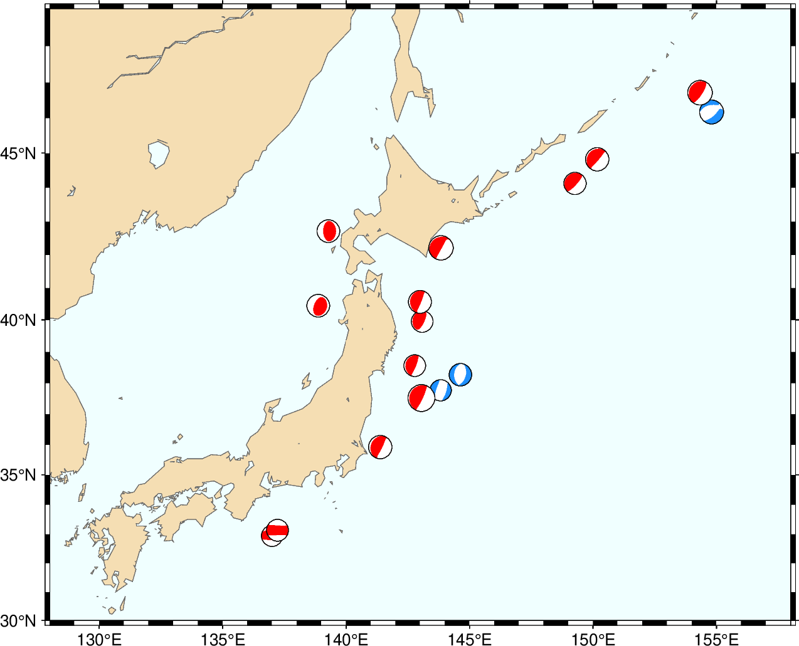

*Figure 12. GMT map of the test data coloured by regime: normal and normal – strike-slip in blue, reverse in red.*

Similarly, the clusters can be mapped using the `Cluster_ID` column (column 15 of the `CMT` output):

``` bash
FMC.py jap_select.dat -cn 3 -ci lon,lat > clusters.dat
gmt begin japan_spatial_clusters png
  gmt coast -R128/158/30/49 -JM15c -Baf -BWSne -Gwheat -Sazure -W0.25p,gray40
  awk '$15==1' clusters.dat | gmt meca -Sm0.3c+f0 -Gorange -W0.3p
  awk '$15==2' clusters.dat | gmt meca -Sm0.3c+f0 -Gpurple -W0.3p
  awk '$15==3' clusters.dat | gmt meca -Sm0.3c+f0 -Gseagreen -W0.3p
gmt end show
```

#### 4.6 Command-line reference

``` text
FMC.py [infile] [-i {CMT,AR,P,PT}] [-o {CMT,P,AR,K,ALL,CUSTOM}] [-of FIELDS]
       [-p PLOTFILE] [-pd PLOTFILE] [-pc PARAM] [-pa PARAM] [-pg SPACING] [-pt TITLE]
       [-cm METHOD] [-ce METRIC] [-cn N] [-ci FIELDS]
       [-v] [-helpFields] [-h]
```

| Flag          | Description                                                     | Section |
|:--------------|:----------------------------------------------------------------|:--------|
| `infile`      | Input file; if absent, FMC reads the standard input             | 4.1     |
| `-i`          | Input format: `CMT` (default), `AR`, `P`, `PT`                  | 4.1     |
| `-o`          | Output format: `CMT` (default), `P`, `AR`, `K`, `ALL`, `CUSTOM` | 4.2     |
| `-of`         | Comma-separated parameters for `-o CUSTOM`                      | 4.2     |
| `-p`          | Classification diagram file                                     | 4.3     |
| `-pd`         | Source-type diagram file                                        | 4.3     |
| `-pc`         | Parameter used to colour the symbols                            | 4.3     |
| `-pa`         | Parameter used to label the symbols                             | 4.3     |
| `-pg`         | Gridline spacing in degrees                                     | 4.3     |
| `-pt`         | Plot title                                                      | 4.3     |
| `-cm`         | Clustering linkage method                                       | 4.4     |
| `-ce`         | Clustering distance metric                                      | 4.4     |
| `-cn`         | Number of clusters (0: automatic)                               | 4.4     |
| `-ci`         | Comma-separated clustering parameters                           | 4.4     |
| `-v`          | Verbose: progress information on the standard error             | —       |
| `-helpFields` | Lists the parameter names and exits                             | 4.2     |
| `-h`          | Shows the help and exits                                        | —       |

#### 4.7 Troubleshooting and known issues

**“ERROR - Incorrect number of columns”.** Each input format requires an exact number of columns (13, 10, 14 or 10 for `CMT`, `AR`, `P` and `PT`). Check the chosen `-i` format, remove extra columns (such as the `rupture_type` column of a previous FMC output) and make sure that event IDs contain no spaces.

**“ERROR - The clustering methods ‘centroid’, ‘median’ and ‘ward’ only work with the ‘euclidean’ metric”.** A non-Euclidean metric was chosen with `-ce` while keeping the default linkage method. Add `-cm single`, `complete`, `average` or `weighted`, or use `-ce euclidean`.

**“Warning, to fill the symbols a numeric value is needed”.** The parameter chosen with `-pc` is not numeric (for example `clas` or alphanumeric event IDs); the symbols are drawn in white.

**`BrokenPipeError` when piping into `head`.** Harmless: the output was interrupted by the receiving program after it read what it needed.

**PT input gives unexpected planes.** The P and T axes must be orthogonal; FMC does not check or correct this.

**Errors in versions before 1.9.1.** In FMC 1.9 and earlier, `-pa` fails with `TypeError: only 0-dimensional arrays can be converted to Python scalars` when using NumPy 2.x, and `-pd` fails with a single event or when all the magnitudes are equal (always with `PT` input). Update to version 1.9.1 or later (section [2](#2-versions)).

### 5. License

`FMC` has been developed with Free Software and/or Open Source tools. `FMC` uses `NumPy`, `SciPy` and `matplotlib` which are distributed under BSD license.

`FMC` is distributed under [GNU General Public License v3.0](https://www.gnu.org/licenses/gpl-3.0.html). This manual is distributed under the Creative Commons Attribution-NonCommercial-ShareAlike 4.0 International license ([CC BY-NC-SA 4.0](https://creativecommons.org/licenses/by-nc-sa/4.0/legalcode)).

## Part II — The background

### 6. Introduction

Seismicity is frequently used to deduce the tectonics of a region. The study of earthquakes as a tectonic component, the seismotectonics (Scholz, 2002), has grown as one of the key research areas on active tectonics, specially from the analysis of earthquake focal mechanisms.

The first focal mechanism determination methods, based on P wave’s first motion polarities, were developed on the first half of the 20th century, specially in Japan where a dense seismic network were available (Byerly, 1938, 1928; Honda and Masatuke, 1952; Koning, 1941; Scheidegger, 1957). Since 1960 the development of the digital computer allow the numerical determination of fault-plane solutions with different methods (Dziewonski et al., 1981; e.g. Knopoff, 1961; Langston and Helmberger, 1975).

In parallel with the development of the modern seismology, the theory of Plate Tectonics changed the way geologists understand the Earth. Since the end of the 16th century naturalists made observations on the potential continental drifting; but it was in the early 20th century when the theory started to be formally proposed (Holmes, 1931; Schwinner, 1919; Taylor, 1910; Wegener, 1912). The relevant information acquired on the magnetic stripes on the ocean floor in the 60’s (e.g. Hess, 1962; Le Pichon, 1968; Morgan, 1968; Vine, 1966), in addition to an increasing number of geological and geophysical observations, established the Plate Tectonics as the global geodynamical paradigm on Earth Sciences. The study of earthquakes related to Plate Tectonics was developed at the same time establishing the basic concepts of seismotectonics and the lithospheric deformation (e.g. Benioff, 1954; Isacks et al., 1968; Isacks and Molnar, 1969; Sykes, 1967).

Since the 70’s focal mechanisms are computed in a systematic way and global catalogs of focal mechanisms are available since then. As the amount of data increases, our knowledge on the active tectonics improves. As a consequence of the continuous increase of data available we need new tools to analyze it systematically.

In order to represent focal mechanism populations Frohlich and Apperson (1992) proposed a diagram to visualize focal mechanism data as a function of the rupture type. This kind of representation is popular and widely used on seismotectonics to represent the focal mechanism types of the study areas (Borges et al., 2001; e.g. Frohlich et al., 1997; Igarashi et al., 2001; Kita et al., 2006; Ratchkovski and Hansen, 2002; Serpelloni et al., 2007). This representation is not accurate, presenting distortion problems (Frohlich, 2001), and Kagan (2005) used the Kaverina et al. (1996) projection to avoid them. The latter projection is used in `FMC` by default.

### 7. The focal mechanism

The term “focal mechanism” is used to refer to the parameters that characterize an earthquake rupture. A focal mechanism usually presents the characteristics of the two orthogonal possible rupture planes: strike, dip and rake of the slip vector over the plane. The energy released by the event, its hypocentral location and the exact time of occurrence are also given. The focal mechanism can, instead of describe the geometry of the possible rupture planes (6 variables), describe the characteristics of the rupture by means of the seismic moment tensor (SMT) or centroid moment tensor (CMT) (6 variables).

The SMT is based in the representation of the equivalent forces on a point seismic source. In this tensor the sum of angular moments should be null, in other words, the SMT is a symmetric tensor on a three dimensional space (9 components) with 6 independent components:

```math
\mathbf{M}=\begin{pmatrix}M_{XX} & M_{XY} & M_{XZ}\\
M_{YX} & M_{YY} & M_{YZ}\\
M_{ZX} & M_{ZY} & M_{ZZ}
\end{pmatrix}
```
where

```math
M_{XY}=M_{YX},\quad M_{XZ}=M_{ZX},\quad M_{YZ}=M_{ZY}
```

Similarly to the strain tensor where we can define the orientation of the principal axes (eigenvectors) and its magnitudes (eigenvalues), the SMT can be defined by the orientation of its principal axes P, B and T (eigenvectors) and its magnitudes (eigenvalues). The T axis describes the greatest of the eigenvalues, the P describes the lowest and the B the intermediate.

If the seismic event is generated by the slip in a fault rupture, its characteristics should be well described as a double couple moment tensor (Figure 13):
```math
\mathbf{M}=\begin{bmatrix}M_{0} & 0 & 0\\
0 & -M_{0} & 0\\
0 & 0 & 0
\end{bmatrix}
```
where $`M_{0}`$ is the scalar seismic moment.

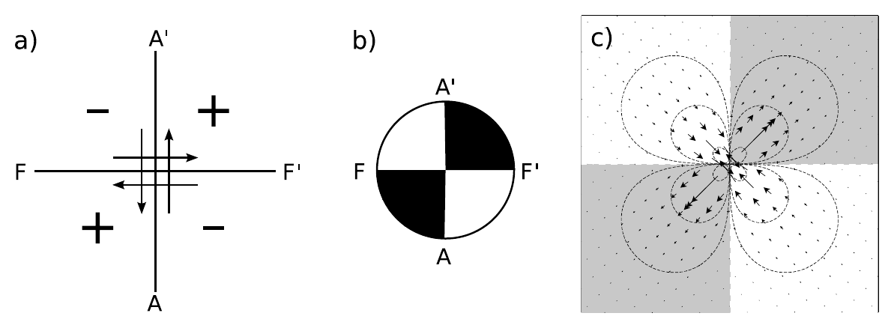

*Figure 13. Double couple deformation mechanism. a) Plan view of horizontal displacement on an idealized point vertical fault A-A’ or F-F’ and resulting distribution of compressions (+) and dilatations (-). b) Focal mechanism representation on a stereographic projection. Compression quadrants are filled. c) Horizontal displacement produced by a point size vertical dislocation computed with the Okada (1992) equations; compressional quadrants are filled while dilatational are kept empty following the focal mechanism representation. a) and b) modified from Bullen and Bolt (1985).*

The most used representation of the double couple is based on the stereographic projection. In this projection both nodal planes of the focal mechanism are plotted, and the quadrants containing the T axis, the compression quadrants, are filled (Figure 13). This kind of representation - commonly called “beach-ball” - located on a map on the earthquake epicenter is useful to interpret the seismic data from a tectonic point of view, allowing the study of the earthquake and its rupture fault plane on its tectonic context, being one of the basis of the seismotectonics. The compressional and dilatational quadrants are separated by two orthogonal planes, the nodal planes, being one of them the plane of rupture that generated the earthquake (Figure 14).

As we increase the number of focal mechanisms to study, we increase the difficulty to interpret the data, obscuring frequently the details of a tectonic environment if we just project them over a map. In order to facilitate the study of groups of focal mechanisms several plots can be proposed, great part of them based on classical structural geology plots.

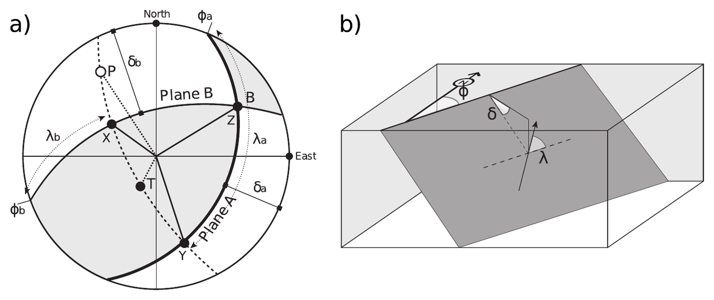

*Figure 14. a) Focal sphere diagram on stereographic projection on the lower hemisphere. Nodal planes A and B, A representing the fault plane and B the auxiliary plane, with its orientation characteristics: $`\varphi`$, strike; $`\delta`$, dip and $`\lambda`$, rake. The orientation of the SMT principal axes are also shown: T, B and P. Modified from Udı́as (1989). b) Block diagram showing the parameters that define the orientation of a fault plane in the space: $`\varphi`$, strike; $`\delta`$, dip and $`\lambda`$, rake.*

The plots inherited from the structural geology are based in the geometrical characteristics of the nodal planes of the SMT, equivalent to the characteristics of the fault planes: strike ($`\varphi`$), dip ($`\delta`$) and rake ($`\lambda`$) (Figure 14). The main problem of these representations is the duplication of data. Each focal mechanism presents two equivalent and orthogonal nodal planes. The selection of one of them as the fault plane is not straightforward and although from a mechanical point of view they can be discriminated (Gephart, 1990; McKenzie, 1969; Michael, 1987), when both nodal planes are mechanically compatible or reactivated structures can be present, additional geological and/or geophysical information is required. There are as many representations of this kind as possible combinations between these parameters and its derivatives (usually trigonometrical functions). These relations can be represented in biaxial plots or stereographic projections (e.g. Davis and Reynolds, 1996; Pollard and Fletcher, 2005; Ramsay and Huber, 1997).

The focal mechanisms can also be plotted as function of the principal axes T, B and P. These axes form an orthogonal system. The orientation of each axis can be defined in the space as any line, by its direction and plunge. The main advantages of these representations are: the univocality, each focal mechanism is represented by one point; its simplicity of interpretation, the kind of deformation (normal, reverse, strike-slip) is function of the plunge of the axes; and the reduction of errors compared with the planes, as they are derived from the principal axes of the SMT (Vannucci and Gasperini, 2003).

### 8. Parameters computed by FMC

This section describes how FMC obtains each of the parameters listed in section 4.2.

**Moment tensor.** FMC works internally in the Aki and Richards (1980) Cartesian system ($`x`$ north, $`y`$ east, $`z`$ down). The Harvard components ($`r`$ up, $`\theta`$ south, $`\phi`$ east) are converted as:

```math
\mathbf{M} = \begin{pmatrix} M_{\theta\theta} & -M_{\theta\phi} & M_{r\theta} \\ -M_{\theta\phi} & M_{\phi\phi} & -M_{r\phi} \\ M_{r\theta} & -M_{r\phi} & M_{rr} \end{pmatrix}
```

With `AR`, `P` and `PT` input, a double-couple tensor is built from the unit normal $`\mathbf{n}`$ and slip $`\mathbf{d}`$ vectors of nodal plane A as $`M_{ij} = M_0\,(d_i n_j + d_j n_i)`$.

**Principal axes.** The eigenvalues $`\lambda_1 \le \lambda_2 \le \lambda_3`$ of $`\mathbf{M}`$ and their eigenvectors define the P, B and T axes respectively. The trend (azimuth, 0–360°) and plunge (0–90°, downwards) of each axis are given.

**Nodal planes and slip vectors.** The unit normal and slip vectors of the nodal planes are obtained from the P and T unit vectors as $`\mathbf{n} \propto \mathbf{T}+\mathbf{P}`$ and $`\mathbf{d} \propto \mathbf{T}-\mathbf{P}`$; exchanging both vectors gives the other nodal plane. Strike, dip and rake follow the Aki and Richards (1980) convention. The trend of the slip vector of each plane is its azimuth, and its plunge is

```math
\text{plunge} = \arcsin(\sin\lambda\,\sin\delta),
```

positive for slip with a reverse component (rake \> 0) and negative for slip with a normal component (rake \< 0).

**Scalar seismic moment and magnitude.** The scalar moment is computed following Silver and Jordan (1982), and the moment magnitude following Hanks and Kanamori (1979), with $`M_0`$ in dyn·cm:

```math
M_0 = \sqrt{\frac{\lambda_1^2+\lambda_2^2+\lambda_3^2}{2}}, \qquad M_w = \frac{2}{3}\log_{10} M_0 - 10.7333
```

With `AR` input, $`M_0`$ is obtained from Mw by inverting this relation; with `P` input it is read from the mantissa and exponent.

**CLVD ratio and $`\Gamma`$ index.** Both are computed from the eigenvalues of the deviatoric part of the moment tensor, $`\lambda_P \le \lambda_B \le \lambda_T`$, so they are not affected by the isotropic component:

```math
f_{\mathrm{clvd}} = -\frac{\lambda_B}{\max\left(\lvert\lambda_T\rvert, \lvert\lambda_P\rvert\right)}, \qquad
\Gamma = \frac{3\sqrt{6}\,\lambda_T\lambda_B\lambda_P}{\left(\lambda_T^2+\lambda_B^2+\lambda_P^2\right)^{3/2}} .
```

`fclvd` (Frohlich and Davis, 1999) ranges from −0.5 to 0.5 and `Gamma` (Kagan and Knopoff, 1985) from −1 to 1. Both are 0 for a double couple, positive for a tension-dominated CLVD, $`(\lambda_T,\lambda_B,\lambda_P)\propto(2,-1,-1)`$, and negative for a compression-dominated one, $`\propto(1,1,-2)`$. This is also the CLVD sign of the source-type diagram (Hudson et al., 1989; Vavryčuk, 2015), where positive values plot on the left:

| Source                                | `fclvd` | `Gamma` | `u_Hudson` | Position in the source-type diagram |
|:--------------------------------------|:--------|:--------|:-----------|:------------------------------------|
| Positive CLVD (tension-dominated)     | +0.5    | +1      | −1         | left corner, “CLVD (+)”             |
| Double couple                         | 0       | 0       | 0          | centre                              |
| Negative CLVD (compression-dominated) | −0.5    | −1      | +1         | right corner, “CLVD (−)”            |

Other definitions differ in sign or scale, so check the convention before comparing values: Giardini (1984) uses the opposite sign of `fclvd` (also the $`\epsilon`$ of (Tape and Tape, 2012)); the $`C_{\mathrm{CLVD}}`$ of Vavryčuk (2015) equals $`2 f_{\mathrm{clvd}}`$ for deviatoric tensors; and $`\Gamma`$ is not linear in `fclvd` ($`\Gamma \approx 2.6 f_{\mathrm{clvd}}`$ for small values). Kagan and Knopoff (1985) caution that the accuracy of catalogue solutions is too low to interpret small CLVD values in terms of source complexity. Since they describe only the deviatoric part, for tensors with a dominant isotropic component they should be read together with `fiso` and the source-type diagram.

**Isotropic component.** The isotropic component is one third of the trace of the tensor, $`\mathrm{iso} = \mathrm{tr}(\mathbf{M})/3`$ (dyn·cm), and its ratio to the scalar moment is $`f_{\mathrm{iso}} = \mathrm{iso}/M_0`$. Global CMT solutions are constrained to be deviatoric, so for them these values are zero within the rounding of the input data.

**Position on the diagrams.** The coordinates on the classification diagram (`x_kav`, `y_kav`) are described in section [9](#9-diagram), and those on the source-type diagram (`u_Hudson`, `v_Hudson`) in section [11](#11-the-source-type-diagram).

**Note on results from older versions.** Since version 1.10, `fclvd` has the opposite sign to versions 1.8.1 to 1.9.1 (definition of (Giardini, 1984)), so old values must be multiplied by −1; it is also computed from the deviatoric eigenvalues, which changes it slightly (up to 0.005 in the Global CMT test data) when the input tensor has a non-zero trace. Before version 1.8.1 it was an absolute value (Frohlich and Apperson, 1992), and earlier versions computed the scalar moment as the average of the absolute largest and smallest eigenvalues (Dziewonski et al., 1981), so small differences in `Mo`, `mant` and `Mw` are also expected when comparing with those versions.

### 9. Diagram

Frohlich and Apperson (1992) developed a ternary diagram to represent focal mechanisms based in the trigonometrical relation:
```math
\sin^{2}\iota_{T}+\sin^{2}\iota_{B}+\sin^{2}\iota_{P}=1,
```
where $`\iota_{T}`$, $`\iota_{B}`$ and $`\iota_{P}`$ are the plunges of the axis T, B and P of the SMT. This relation is true for three orthogonal axes.

As the equation of a sphere with radius unity is
```math
x^{2}+y^{2}+z^{2}=1
```
and all the plunge angles are positive between 0°and 90°, then the representation of a focal mechanism defined by these axes is equivalent to the projection of a point in an spherical octant over a planar surface. As a sphere is not a developable surface can not be projected onto a plane without distortion.

The projection used by Frohlich and Apperson (1992) represents this spherical octant as a triangle, which is equivalent to the gnomonic geographical projection. In this projection we define the angles
```math
\psi=\arctan\left(\dfrac{\sin\iota_{T}}{\sin\iota_{P}}\right)-45^{\circ},
```
and
```math
\iota_{s}=\arcsin\dfrac{1}{\sqrt{3}}=\arctan\dfrac{1}{\sqrt{2}}\approx35.26^{\circ},
```
which is the angle of the ternary symmetry axis with the orthogonal axes of the octant.

From these angles the $`x`$ and $`y`$ coordinates over the plane are given by:
```math
\begin{aligned}
x&=\dfrac{\cos\iota_{B}\cdot\sin\psi}{\sin\iota_{s}\cdot\sin\iota_{B}+\cos\iota_{s}\cdot\cos\iota_{B}\cdot\cos\psi}\\
y&=\dfrac{\cos\iota_{s}\cdot\sin\iota_{B}-\sin\iota_{s}\cdot\cos\iota_{B}\cdot\cos\psi}{\sin\iota_{s}\cdot\sin\iota_{B}+\cos\iota_{s}\cdot\cos\iota_{B}\cdot\cos\psi}
\end{aligned}
```
The angle $`\iota_{s}`$ in the projection is the angle of the plunges of the axes T, B and P for the focal mechanism that occupies the barycentre of the ternary diagram where $`x=y=0`$.

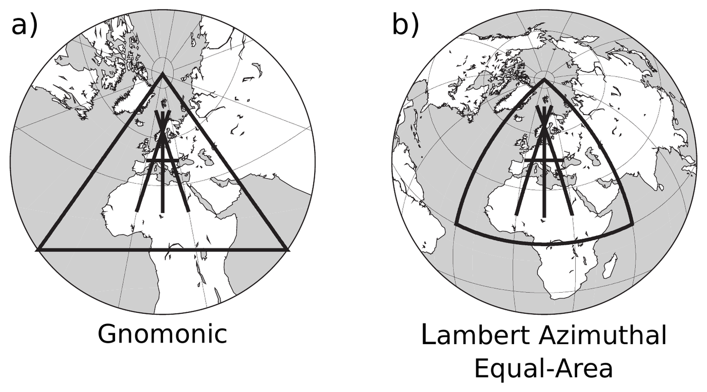

*Figure 15. Representation of an hemisphere of the globe centred on Europe (45 N, 15E) in the two different projections referenced in the text: a) Gnomonic projection; b) Lambert azimuthal equal-area. In thick lines are marked the spheric octant and some reference lines in order to compare both projections.*

As can be seen in Figure 15a this projection introduces remarkable distortions towards the extremes of the diagram. This distortions could difficult the study of some groups of focal mechanisms as the author pointed out (Frohlich, 2001). In order to avoid these distortions Kaverina et al. (1996) proposed the use of a projection capable of maintain the proportion of the areas equal, equivalent to the Lambert azimuthal equal-area projection (Figure 15b), which is the used in structural geology to generate the stereographic equal-area Schmidt stereonet. In this case the limits of the diagram are formed by great circles instead of straight lines forming a triangle (Figure 15).

If we take the sines of the plunges of the main axes $`\iota_{T}`$, $`\iota_{B}`$ and $`\iota_{P}`$:

```math
z_{T}=\sin\iota_{T},\quad z_{P}=\sin\iota_{P},\quad z_{B}=\sin\iota_{B}
```

the length of the vector that connects the center of the diagram with the projected point is defined by

```math
L=2\sin\left[\frac{1}{2}\cdot\arccos\left(\dfrac{z_{T}+z_{P}+z_{B}}{\sqrt{3}}\right)\right]
```

and the normalization factor is:

```math
N=\sqrt{2\cdot[(z_{B}-z_{P})^{2}+(z_{B}-z_{T})^{2}+(z_{T}-z_{P})^{2}]}
```

The coordinates of the projected focal mechanisms in the plane are defined as follows (these equations correct a typo present in Kagan (2005)):

```math
\begin{aligned}
x&=\sqrt{3}\cdot\frac{L}{N}\cdot(z_{T}-z_{P})\\
y&=\frac{L}{N}\cdot(2z_{B}-z_{P}-z_{T})
\end{aligned}
```

### 10. Focal Mechanism Classification

In order to classify the focal mechanisms Kagan (2005) divided the octant in three areas (Figure 16b) corresponding to the three basic Andersonian regimes: normal, reverse and strike-slip. The dividing lines start at the diagram center and run through the middle of each great circle (dashed lines in Figure 16b). This classification, although simple and straightforward, is too basic sometimes for a detailed seismotectonic study.

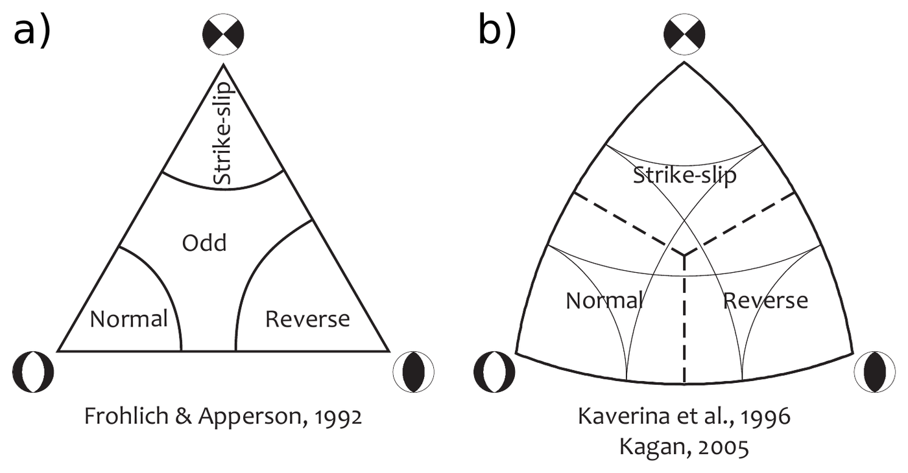

*Figure 16. Focal mechanisms classification diagrams based on SMT axes plunges proposed by a) Frohlich and Apperson (1992) and b) Kagan (2005).*

From the seismotectonic point of view an earthquake reflects the brittle lithospheric strain produced by tectonic processes. The vast majority of earthquakes are produced by displacements on faults (some other processes as deep volume changes or cave collapses can produce seismic signals too), and they are interpreted usually as fault ruptures. Following this reasoning the most appropriate classification for the focal mechanism should be done by means of the slip vector on the fault, given by the rake angle. This classification can be done following one of the proposed conventions (Aki and Richards, 1980; Angelier, 1994; Rickard, 1972). As has been mentioned before, the problem is the duplicity of data due to the two nodal planes solution of the focal mechanism.

An extended discussion on the relation among the different focal mechanism parameters can be found on Célérier (2010); the author also points out the difficulty on interpreting the stress state from the focal mechanisms, specially where oblique faulting takes place and reactivation of inherited structures is possible (Wyss et al., 1992).

However the SMT can be interpreted as a seismic strain tensor (Kostrov, 1974) where the main axes are equivalent to the SMT main axes (Wyss et al., 1992). With this relation in mind we can interpret the populations of focal mechanisms as representations of strains in different tectonic settings. Oblique slip focal mechanisms with normal component can be interpreted as transtensional strain, while oblique slip focal mechanisms with reverse component can be interpreted as transpressional.

In order to count with a classification more detailed than the one of Kagan (2005) I decided to classify the focal mechanism in a series of fields that include the oblique slip regimes (Álvarez-Gómez, 2009). This approximation is similar to the Johnston et al. (1994) classification; with 7 classes of earthquakes: 1) Normal; 2) Normal - Strike-slip; 3) Strike-slip - Normal; 4) Strike-slip; 5) Strike-slip - Reverse; 6) Reverse - Strike-slip and 7) Reverse. The resulting diagram incorporating this 7 fields classification to the Kaverina projection is shown in Figure 17.

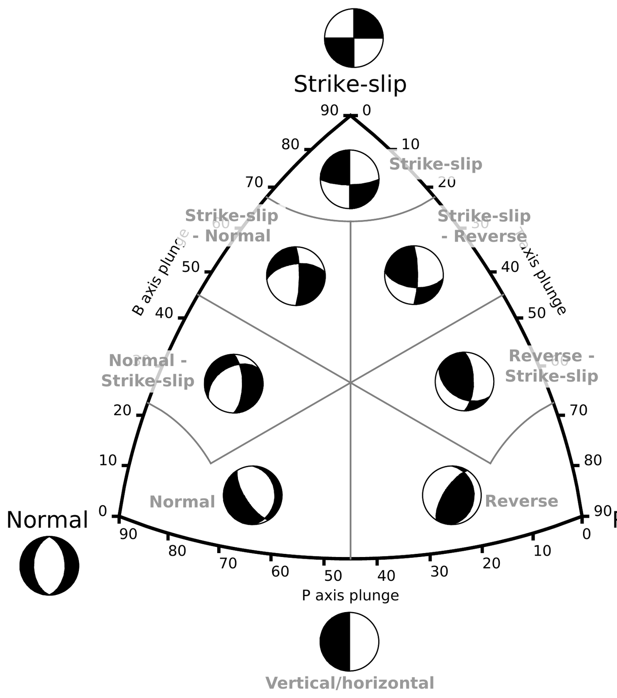

*Figure 17. Focal mechanism classification diagram. N) Normal; N-SS) Normal - Strike-slip; SS-N) Strike-slip - Normal; SS) Strike-slip; SS-R) Strike-slip - Reverse; R-SS) Reverse - strike-slip and R) Reverse.*

The algorithm to classify the focal mechanisms based on the SMT main axes plunges is the shown in Figure 1.

When one of the three main SMT axes is greater or equal than 67.5$`^{\circ}`$ (resulted from $`3\cdot\frac{\pi/2}{4}`$) we obtain a pure Andersonian tectonic regime. From the pure normal or reverse faulting to the strike-slip faulting there is a range of oblique faulting types with more or less relevance of the horizontal component. On the other hand between the pure normal and pure reverse faulting there is a permutation of the T and P axes in the vertical position, while the B axis remains horizontal. The transition takes place when the P and T axes plunge equally and a vertical nodal plane is present.

In the following section I compare the results of both classifications, the one based in the main axes plunges of the moment tensor and the one based on the fault rakes.

#### 10.1 Comparison between rake-based and SMT axes-based classifications

In order to classify the nodal planes according to its rakes I adopted a convention hybrid between the Rickard (1972) and Aki and Richards (1980) conventions. The focal mechanism rakes are usually given with the Aki and Richards (1980) convention, while from a geological point of view the Rickard (1972) convention is more used. I define 7 equivalent classes to those used in the SMT axes-based classifications (Figure 18).

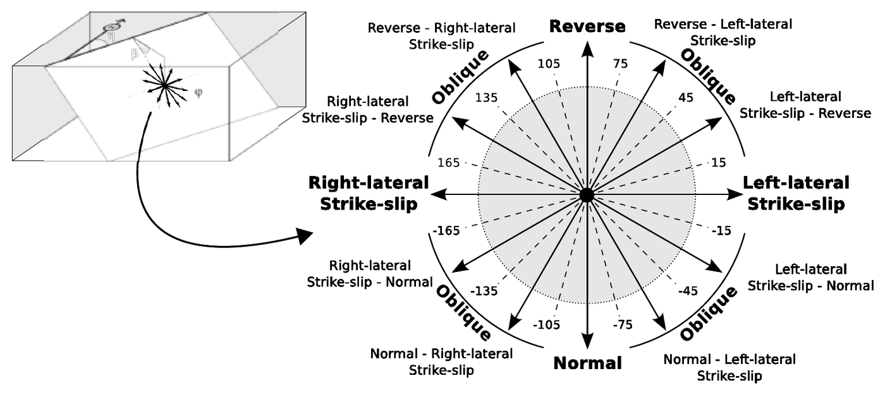

*Figure 18. Diagram showing the convention used in this work for the rake classification of faults or focal mechanism nodal planes. Inside the grey circle the equivalent SMT axes-based classification is shown (Figure 17).*

Each one of the nodal planes of the focal mechanisms from the Global CMT catalog (Ekström et al., 2012) is classified according to the rake classification shown in Figure 18. From the analysis of the focal mechanism alone we cannot choose unequivocally the fault plane responsible of the earthquake. To analyze the degree of uncertainty I show in Figure 19a the relative frequency of relations between nodal planes rupture types. For example, it can be seen that when one nodal plane is classified as normal, the other can be normal as well, or can present some strike-slip component, but it can not present reverse component; the same can be said for the reverse nodal planes. When one nodal plane is pure strike-slip, the other can present dip-slip component too, ranging from normal with strike-slip component (N-SS) to reverse with strike-slip component (R-SS), but being more frequent the relations between nodal planes of mainly strike-slip type.

Comparing the focal mechanism classified with the SMT axes and the nodal planes classified with the rakes (Figure 19b) a similar picture as the described above can be seen. The percentages of relations change sensibly, but the common picture is the same. When the focal mechanism is classified as normal type we can expect that both nodal planes are of normal type or normal with some strike-slip component. Similarly when the focal mechanism is classified as reverse, both nodal planes are mainly of the reverse type too. For the case of the strike-slip focal mechanism almost all the nodal planes are of strike-slip type too.

We can conclude that there is not much difference between the results obtained from the rake classification of the nodal planes and the classification of the focal mechanism attending to the SMT axes plunges. The focal mechanism classification based on the SMT axes has the advantage of the univocallity of its classification, in contrast with the duplicity of data and uncertainty related to the nodal planes rake classification.

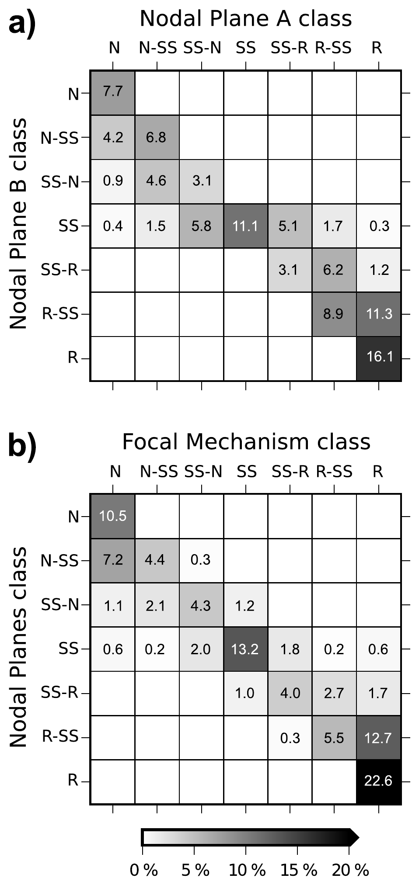

*Figure 19. Heatmaps of the proportion of relations between a) both nodal planes rupture type based on the rake classification, and b) between the focal mechanism classification and the nodal planes rupture types rake classification. The data used is the entire Global CMT catalog (Ekström et al., 2012). Numbers show percentages over the entire catalogue.*

### 11. The source-type diagram

The classification diagram describes the double-couple part of the moment tensor. To analyse the non-double-couple components, FMC also plots the source-type diagram of Hudson et al. (1989), in the skewed-diamond form described by Vavryčuk (2015) (flag `-pd`). The eigenvalues $`\lambda_1 \le \lambda_2 \le \lambda_3`$ are normalised by the largest absolute eigenvalue, $`\hat\lambda_i = \lambda_i / \max_j \lvert\lambda_j\rvert`$, and the coordinates are

```math
u = -\frac{2}{3}\left(\hat\lambda_1 + \hat\lambda_3 - 2\hat\lambda_2\right), \qquad v = \frac{1}{3}\left(\hat\lambda_1 + \hat\lambda_2 + \hat\lambda_3\right).
```

The vertical coordinate $`v`$ measures the isotropic component: pure explosions plot at the top vertex ($`v=1`$) and pure implosions at the bottom one ($`v=-1`$). The horizontal coordinate $`u`$ measures the CLVD component: a pure double couple plots at the centre, and pure CLVD sources at $`u=\pm 1`$ on the horizontal axis. Because $`u`$ is minus the CLVD coordinate of the standard decomposition (Vavryčuk, 2015, eqs. 7 and 42), positive CLVDs (tension-dominated) plot at the left corner ($`u=-1`$, labelled “CLVD (+)”) and negative CLVDs (compression-dominated) at the right corner ($`u=+1`$, labelled “CLVD (−)”). For deviatoric tensors $`v=0`$ and $`u=-2 f_{\mathrm{clvd}}`$, so events with positive `fclvd` plot on the left and events with negative `fclvd` on the right (section [8](#8-parameters-computed-by-fmc)). The dashed diagonal line of the diagram joins the two lateral vertices, at $`(\pm 4/3, \pm 1/3)`$.

## Acknowledgments

I have been using different versions of this program during the last decade. Initially I reworked some of the Gasperini and Vannucci (2003) FORTRAN subroutines on Matlab in order to obtain all the focal mechanism parameters from the Harvard CMT `psmeca` formatted catalog. During my research on seismotectonics I started to use the Frohlich and Apperson (1992) diagram, but after Kagan (2005) I decided to try the Kaverina et al. (1996) one. From the original Matlab program I jumped to the Free Software world adapting it to Octave. The program only produced the x and y positions of the events and all the plotting was done by means of GMT (Wessel et al., 2013).

Some colleagues wanted to use the diagram for their work, but they were not familiar with GMT, so I decided to make a big improvement in the program to make it easy to use, distributable and with plotting support. I choose to program it in Python with the following basic ideas:

1.  It should be called from the terminal or the command line in order to be incorporated into shell scripts

2.  It should behave like any other shell unix tool, compatible with redirection, piping and ASCII format

3.  it should be compatible with the GMT `psmeca` formats to allow the mapping of the focal mechanisms

4.  It should has the option to produce a Kaverina et al. (1996) type classification diagram

Part of the programming was done during my happy days as Ph.D. candidate at the UCM; so I have to acknowledge the UCM scholarship that allowed me to start my scientific career.

I would like to thank the beta testers Jorge L. Giner-Robles and Alberto Jiménez-Díaz for their comments and suggestions. Dr. Andrei Bala (National Institute for Earth Physics, Romania) has tested different versions and suggested several improvements.

If you use `FMC`, and consider it appropriate, you can acknowledge it by citing the following reference:

- Álvarez-Gómez, J. A. (2019). FMC—Earthquake focal mechanisms data management, cluster and classification. SoftwareX, 9, 299-307. <https://doi.org/10.1016/j.softx.2019.03.008>

You should cite the SoftwareX paper if you are using the last version of the program with clustering and several plot customization options.

BibTeX entry of the SoftwareX paper:

``` bibtex
@article{AlvarezGomez2019FMC,
  author  = {{\'A}lvarez-G{\'o}mez, Jos{\'e} A.},
  title   = {{FMC}---Earthquake focal mechanisms data management, cluster and classification},
  journal = {SoftwareX},
  volume  = {9},
  pages   = {299--307},
  year    = {2019},
  doi     = {10.1016/j.softx.2019.03.008}
}
```

## References

Aki, K., Richards, P., 1980. Quantitative seismology, theory and methods. W.H. Freeman, San Francisco.

Álvarez-Gómez, J.A., 2009. Tectónica activa y geodinámica en el norte de centroamérica (PhD thesis). Universidad Complutense de Madrid, Madrid.

Angelier, J., 1994. Palaeostress analysis of small-scale brittle structures, in: Hancock, P. (Ed.), Continental Deformation. Pergamon Press, p. 421.

Benioff, H., 1954. Orogenesis and deep crustal structure — additional evidence from seismology. Geological Society of America Bulletin 65, 385–400.

Borges, J.F., Fitas, A.J., Bezzeghoud, M., Teves-Costa, P., 2001. Seismotectonics of portugal and its adjacent atlantic area. Tectonophysics 331, 373–387.

Bullen, K.E., Bolt, B.A., 1985. An introduction to the theory of seismology, 4th ed. Cambridge University Press, Cambridge.

Byerly, P., 1938. The earthquake of july 6, 1934: Amplitudes and first motion. Bulletin of the Seismological Society of America 28, 1–13.

Byerly, P., 1928. The nature of the first motion in the chilean earthquake of november 11, 1922. American Journal of Science, Series 5 16, 232–236.

Célérier, B., 2010. Remarks on the relationship between the tectonic regime, the rake of the slip vectors, the dip of the nodal planes, and the plunges of the p, b, and t axes of earthquake focal mechanisms. Tectonophysics 482, 42–49. <https://doi.org/10.1016/j.tecto.2009.03.006>

Davis, G.H., Reynolds, S.J., 1996. Structural geology of rocks and regions, 2nd ed. Wiley, New York.

Dziewonski, A.M., Chou, T.A., Woodhouse, J.H., 1981. Determination of earthquake source parameters from waveform data for studies of global and regional seismicity. Journal of Geophysical Research 86, 2825–2852.

Ekström, G., Nettles, M., Dziewoński, A.M., 2012. The global CMT project 2004–2010: Centroid-moment tensors for 13,017 earthquakes. Physics of the Earth and Planetary Interiors 200–201, 1–9.

Frohlich, C., 2001. Display and quantitative assessment of distributions of earthquake focal mechanisms. Geophysical Journal International 144, 300–308. <https://doi.org/10.1046/j.1365-246x.2001.00341.x>

Frohlich, C., Apperson, K.D., 1992. Earthquake focal mechanisms, moment tensors, and the consistency of seismic activity near plate boundaries. Tectonics 11, 279–296.

Frohlich, C., Coffin, M.F., Massell, C., Mann, P., Schuur, C.L., Davis, S.D., Jones, T., Karner, G., 1997. Constraints on macquarie ridge tectonics provided by harvard focal mechanisms and teleseismic earthquake locations. Journal of Geophysical Research 102, 5029–5041.

Frohlich, C., Davis, S.D., 1999. How well constrained are well-constrained t, b, and p axes in moment tensor catalogs? Journal of Geophysical Research 104, 4901–4910.

Gasperini, P., Vannucci, G., 2003. FPSPACK: A package of FORTRAN subroutines to manage earthquake focal mechanism data. Computers & Geosciences 29, 893–901.

Gephart, J.W., 1990. Stress and the direction of slip on fault planes. Tectonics 9, 845–858.

Giardini, D., 1984. Systematic analysis of deep seismicity: 200 centroid-moment tensor solutions for earthquakes between 1977 and 1980. Geophysical Journal of the Royal Astronomical Society 77, 883–914.

Hanks, T.C., Kanamori, H., 1979. A moment magnitude scale. Journal of Geophysical Research 84, 2348–2350.

Hess, H.H., 1962. History of ocean basins. Petrologic Studies 4, 599–620.

Holmes, A., 1931. Radioactivity and earth movements. Nature 128, 496.

Honda, H., Masatuke, A., 1952. On the mechanism of the earthquakes and the stresses producing them in japan and its vicinity. Science Reports of the Tohoku University 4.

Hudson, J.A., Pearce, R.G., Rogers, R.M., 1989. Source type plot for inversion of the moment tensor. Journal of Geophysical Research 94, 765–774.

Igarashi, T., Matsuzawa, T., Umino, N., Hasegawa, A., 2001. Spatial distribution of focal mechanisms for interplate and intraplate earthquakes associated with the subducting pacific plate beneath the northeastern japan arc: A triple-planed deep seismic zone. Journal of Geophysical Research 106, 2177–2191.

Isacks, B., Molnar, P., 1969. Mantle earthquake mechanisms and the sinking of the lithosphere. Nature 223, 1121–1124.

Isacks, B., Oliver, J., Sykes, L.R., 1968. Seismology and the new global tectonics. Journal of Geophysical Research 73, 5855–5899.

Johnston, A.C., Coppersmith, K.J., Kanter, L.R., Cornell, C.A., 1994. The earthquakes of stable continental regions. Volume 1: Assessment of large earthquake potential (Technical Report). Electric Power Research Institute.

Kagan, Y.Y., 2005. Double-couple earthquake focal mechanism: Random rotation and display. Geophysical Journal International 163, 1065–1072.

Kagan, Y.Y., Knopoff, L., 1985. The first-order statistical moment of the seismic moment tensor. Geophysical Journal of the Royal Astronomical Society 81, 429–444.

Kaverina, A.N., Lander, A.V., Prozorov, A.G., 1996. Global creepex distribution and its relation to earthquake-source geometry and tectonic origin. Geophysical Journal International 125, 249–265.

Kita, S., Okada, T., Nakajima, J., Matsuzawa, T., Hasegawa, A., 2006. Existence of a seismic belt in the upper plane of the double seismic zone extending in the along-arc direction at depths of 70–100 km beneath NE japan. Geophysical Research Letters 33.

Knopoff, L., 1961. Analytical calculation of the fault-plane problem. Publications of the Dominion Observatory (Ottawa) 24, 309–315.

Koning, L.P.G., 1941. On the mechanism of deep focus earthquakes. Gerlands Beiträge zur Geophysik 58, 159–197.

Kostrov, V., 1974. Seismic moment and energy of earthquakes, and seismic flow of rock. Izvestiya, Physics of the Solid Earth 1, 23–40.

Langston, C.A., Helmberger, D.V., 1975. A procedure for modelling shallow dislocation sources. Geophysical Journal of the Royal Astronomical Society 42, 117–130.

Le Pichon, X., 1968. Sea-floor spreading and continental drift. Journal of Geophysical Research 73, 3661–3697.

McKenzie, D.P., 1969. The relation between fault plane solutions for earthquakes and the directions of the principal stresses. Bulletin of the Seismological Society of America 59, 591–601.

Michael, A.J., 1987. Use of focal mechanisms to determine stress: A control study. Journal of Geophysical Research 92, 357–368.

Morgan, W.J., 1968. Rises, trenches, great faults, and crustal blocks. Journal of Geophysical Research 73, 1959–1982.

Okada, Y., 1992. Internal deformation due to shear and tensile faults in a half-space. Bulletin of the Seismological Society of America 82, 1018–1040.

Pollard, D.D., Fletcher, R.C., 2005. Fundamentals of structural geology. Cambridge University Press, Cambridge.

Ramsay, J.G., Huber, M.I., 1997. The techniques of modern structural geology, vol. 2: Folds and fractures, 5th ed. Academic Press, London.

Ratchkovski, N.A., Hansen, R.A., 2002. New evidence for segmentation of the alaska subduction zone. Bulletin of the Seismological Society of America 92, 1754–1765.

Rickard, M.J., 1972. Fault classification: discussion. Geological Society of America Bulletin 83, 2545–2546.

Scheidegger, A.E., 1957. The geometrical representation of fault-plane solutions of earthquakes. Bulletin of the Seismological Society of America 47, 89–110.

Scholz, C.H., 2002. The mechanics of earthquakes and faulting, 2nd ed. Cambridge University Press, Cambridge.

Schwinner, R., 1919. Vulkanismus und gebirgsbildung: Ein versuch. Reimer.

Serpelloni, E., Vannucci, G., Pondrelli, S., Argnani, A., Casula, G., Anzidei, M., Baldi, P., Gasperini, P., 2007. Kinematics of the western africa–eurasia plate boundary from focal mechanisms and GPS data. Geophysical Journal International 169, 1180–1200.

Silver, P.G., Jordan, T.H., 1982. Optimal estimation of scalar seismic moment. Geophysical Journal of the Royal Astronomical Society 70, 755–787.

Sykes, L.R., 1967. Mechanism of earthquakes and nature of faulting on the mid-oceanic ridges. Journal of Geophysical Research 72, 2131–2153.

Tape, W., Tape, C., 2012. A geometric setting for moment tensors. Geophysical Journal International 190, 476–498.

Taylor, F.B., 1910. Bearing of the tertiary mountain belt on the origin of the earth’s plan. Geological Society of America Bulletin 21, 179–226.

Udı́as, A., 1989. Parámetros del foco de los terremotos. Fı́sica de la Tierra 1, 87–104.

Vannucci, G., Gasperini, P., 2003. A database of revised fault plane solutions for italy and surrounding regions. Computers & Geosciences 29, 903–909.

Vavryčuk, V., 2015. Moment tensor decompositions revisited. Journal of Seismology 19, 231–252. <https://doi.org/10.1007/s10950-014-9463-y>

Vine, F.J., 1966. Spreading of the ocean floor: New evidence. Science 154, 1405–1415.

Wegener, A., 1912. Die entstehung der kontinente. Geologische Rundschau 3, 276–292.

Wessel, P., Smith, W.H.F., Scharroo, R., Luis, J.F., Wobbe, F., 2013. Generic mapping tools: Improved version released. Eos, Transactions American Geophysical Union 94, 409–410.

Wyss, M., Liang, B., Tanigawa, W.R., Wu, X., 1992. Comparison of orientations of stress and strain tensors based on fault plane solutions in kaoiki, hawaii. Journal of Geophysical Research 97, 4769–4790.

[^1]: The details on the clustering algorithms shown in this section are taken from the [SciPy documentation](https://docs.scipy.org/doc/scipy/reference/cluster.hierarchy.html#module-scipy.cluster.hierarchy).
